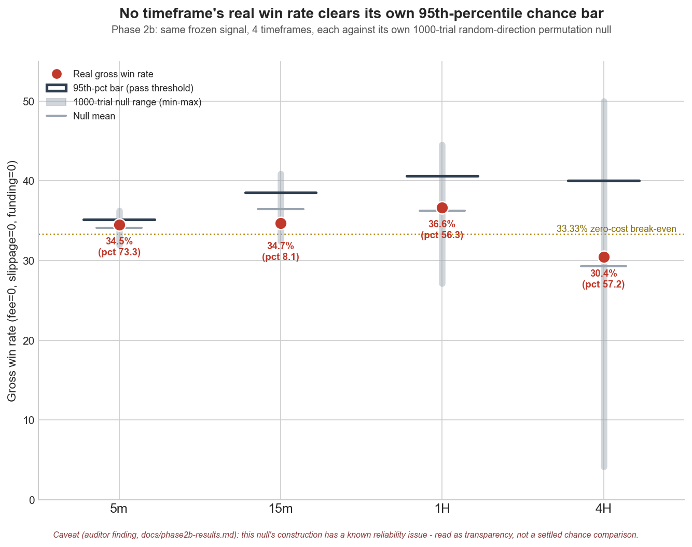

# Phase 2b results: timeframe vs. cost

Pre-registered hypothesis and pass criteria: [`docs/hypothesis-2b.md`](hypothesis-2b.md)
(written and frozen before any of the numbers below existed; not edited after).
This file reports the outcome and is expected to be filled in / appended to
as each timeframe's pipeline run completes.

Status: **all four timeframes done.** 5m, 15m, 1H, 4H all measured against
the same four pre-registered criteria.

## Data provenance

| Bar | Candles | Range | Fetched |
|---|---|---|---|
| 5m | 630,530 | 2020-08-25T04:35Z -> 2026-08-23T12:40Z | Phase 2 (reused, not refetched - per hypothesis doc) |
| 15m | 210,371 | 2020-08-25T04:30Z -> 2026-08-25T13:00Z | 2026-08-25 (this run) |
| 1H | 52,593 | 2020-08-25T04:00Z -> 2026-08-25T12:00Z | 2026-08-25 (this run) |
| 4H | 13,148 | 2020-08-25T04:00Z -> 2026-08-25T08:00Z | 2026-08-25 (this run) |

All four validated via `npx tsx src/validateData.ts`: **zero** duplicate
timestamps, out-of-order rows, OHLC violations, or gaps in any of them.

Caveat: 5m's data ends ~2 days before the other three (it was intentionally
not refetched, per the hypothesis doc's "carried over from Phase 2" clause).
Immaterial against a 6-year range, noted for reproducibility.

Note for the record: rerunning 5m's diagnosis at 1000 trials overwrote
`data/diagnosis-report.txt` and `data/diagnosis-results.json` in place
(`data/` is gitignored, not versioned). Phase 2's original 100-trial 5m
diagnosis output is no longer on disk - superseded by design (this file's
5m numbers are the ones to use going forward), but not separately
recoverable if anyone wants to compare the two trial counts side by side.

## Auditor finding: criterion 3's permutation null is not a real coin-flip baseline

The `auditor` subagent reviewed this work before it was reported (per
CLAUDE.md section 7) and found a **critical** pre-existing flaw in
`src/randomBaseline.ts` (inherited unmodified from Phase 2's diagnosis code,
not introduced by Phase 2b - but Phase 2b promoted it from a supporting note
to the primary pass/fail criterion and the headline claim, which raised its
severity).

`buildDirectionalVariants` is supposed to construct a fair-coin
random-direction baseline by reusing each real signal's anchor and
constructing what the SAME formula would produce in the OPPOSITE direction.
But after three consecutive strong candles in one direction, the opposite
direction's SL construction (`bar2.high` for a would-be short at a real long
anchor, or vice versa) is almost always geometrically degenerate - the
auditor measured this directly: the opposite direction is valid at **0% of
anchors on 4H, 0% on 1H, 0.17% on 15m, 0.345% on 5m**. The code drops a
degenerate anchor entirely (`src/randomBaseline.ts:151`) rather than trading
it the other way, so each "trial" is not a coin-flip over direction - it is
close to **a random ~50% subsample of the real system's own trades**
(confirmed by trial n: 1H trials range 111-163 vs the real 232; 4H 14-37 vs
46; 15m 568-754 vs 1006; 5m 2395-2727 vs 4109). A subsample of a strategy's
own trades is centered on that strategy's own mean by construction, so
criterion 3 as implemented has very little power to detect real edge either
way, and the specific narrative below in earlier drafts of this document
("the coin-flip baseline does almost as well, so this isn't real skill")
overstated what the test actually showed. That narrative has been
withdrawn from the analysis below.

**What this changes:** every criterion-3 percentile in this document should
be read as *reported for transparency, not trusted as a real chance
comparison* - it is neither evidence for nor against directional skill on
any timeframe. **What this does not change:** the overall pass/fail verdict
for every timeframe below, because criteria 1 and 4 (which do not depend on
`randomBaseline.ts`) independently fail on 5m, 15m, and 4H, and 1H
independently fails on criterion 4 alone (out-of-sample n=84 < 100). A
properly-scoped redesign of the permutation null (holding SL distance fixed
in price terms and mirroring it across entry, rather than reusing
`bar2.low`/`bar2.high`, so every anchor trades in both directions and n is
preserved) has been flagged as separate follow-up work, not done here.

## Results by timeframe (fixed order: 5m, 15m, 1H, 4H)

Canonical scenario for criteria 1/2 throughout: slippage=1 tick, ambiguity
resolved to the LOWER bound (SL wins ties), `limit-tp` fee model - same
scenario Phase 2 used. Criterion 3 uses the gross (fee=0/slippage=0/
funding=0) scenario, 1000-trial permutation null, seed 20260824 - **see the
auditor finding immediately above: treat every criterion-3 percentile below
as unreliable, reported for transparency only.**

### 5m

| Criterion | Result | Pass? |
|---|---|---|
| 1. Net E[R] positive in-sample AND out-of-sample | in-sample -0.181R (n=1553), out-of-sample -0.217R (n=155) | **NO** (both negative) |
| 2. Scenario = slip 1 tick, lower bound | applied | (n/a, by construction) |
| 3. Gross win rate > 95th pct of 1000-trial null | real 34.49% vs 95th-pct bar 35.14% - percentile 73.3 | **NO** |
| 4. Out-of-sample n >= 100 | n=155 | YES |

**Verdict: FAILS on criterion 1 alone**, which is sufficient regardless of
criterion 3's reliability. Matches Phase 2's original conclusion (README
"Why Phase 2 is negative"). Criterion 3's 73rd-percentile figure is shown
for continuity with Phase 2's own report but should not be read as evidence
either way, per the auditor finding above.

**Caveat the auditor surfaced and this document did not originally
disclose:** the canonical (cost-bearing) scenario's equity collapses to
roughly 0.41 USDT by the end of the in-sample window (starting from 100
USDT) - a >99.5% drawdown, consistent with Phase 2's original negative
conclusion. At that equity, 2%-of-equity risk is a few cents, so
`computePositionSize` rejects almost every subsequent signal for being
under `minSz`: **1,808 out-of-sample signals are skipped for sizing against
only 155 that open a position.** Those 155 survivors are not a random
out-of-sample sample - they are the minority whose SL happened to be wide
enough (in percentage terms) to still size on a near-dead account. This
does not change 5m's verdict (it already fails criterion 1 outright), but
it means the out-of-sample n=155 satisfying criterion 4 should not be read
as "155 representative trades."

### 15m

| Criterion | Result | Pass? |
|---|---|---|
| 1. Net E[R] positive in-sample AND out-of-sample | in-sample -0.042R (n=807), out-of-sample +0.043R (n=351) | **NO** (in-sample negative) |
| 2. Scenario = slip 1 tick, lower bound | applied | (n/a, by construction) |
| 3. Gross win rate > 95th pct of 1000-trial null | real 34.69% vs 95th-pct bar 38.53% - percentile 8.1 | **NO** |
| 4. Out-of-sample n >= 100 | n=351 | YES |

**Verdict: FAILS on criterion 1 alone** (in-sample net expectancy is
negative), which is sufficient by itself. Criterion 3's 8.1 percentile -
notably below the random baseline's own mean here - is reported for
completeness, but per the auditor finding above this test's null is a
partial subsample of 15m's own trades, not a genuine coin-flip baseline, so
this low percentile is not reliable evidence that the direction call
underperforms chance either. It is not used to support the fail verdict,
which rests on criterion 1 alone.

### 1H

| Criterion | Result | Pass? |
|---|---|---|
| 1. Net E[R] positive in-sample AND out-of-sample | in-sample +0.084R (n=148), out-of-sample +0.041R (n=84) | YES (both positive) |
| 2. Scenario = slip 1 tick, lower bound | applied | (n/a, by construction) |
| 3. Gross win rate > 95th pct of 1000-trial null | real 36.64% vs 95th-pct bar 40.60% - percentile 56.3 | **NO** |
| 4. Out-of-sample n >= 100 | n=84 | **NO** |

**Verdict: FAILS on criterion 4 alone** (out-of-sample n=84, short of the
pre-registered 100-trade floor) - **this is the one criterion-3 percentile
in this document to actually disregard, not just discount.** An earlier
draft of this analysis argued 1H's positive expectancy was "no better than
a coin flip" because the permutation baseline's mean gross E[R] (+0.089) is
close to the real system's (+0.099). The auditor caught that this argument
does not hold: 1H's permutation trials only contain 111-163 trades against
232 real ones, because (per the finding above) the "opposite direction" is
geometrically invalid at essentially every 1H anchor, so each trial is
close to a random half of 1H's own real trades - naturally landing near the
real mean regardless of whether the direction call carries any skill. That
argument is withdrawn.

What is left, on solid ground: 1H is the **only** timeframe where net
expectancy (real costs, slip=1 tick, lower bound) is positive on both sides
of the 70/30 split - in-sample +0.084R (n=148), out-of-sample +0.041R
(n=84). Criterion 4 alone is enough to fail it as pre-registered (84 < 100),
and that is the basis for this verdict, not the disputed permutation
result. Whether 1H's positive expectancy reflects real directional skill
or the trade construction/sizing interacting with these specific anchors is
genuinely unresolved by this phase's tooling - answering it needs either a
corrected permutation null (see the auditor finding above) or a larger
out-of-sample sample than this history currently provides. This makes 1H
the one result worth remembering if the permutation methodology gets fixed
later, not a settled "no edge" the way 5m, 15m, and 4H are.

### 4H

| Criterion | Result | Pass? |
|---|---|---|
| 1. Net E[R] positive in-sample AND out-of-sample | in-sample -0.233R (n=27), out-of-sample +0.090R (n=19) | **NO** (in-sample negative) |
| 2. Scenario = slip 1 tick, lower bound | applied | (n/a, by construction) |
| 3. Gross win rate > 95th pct of 1000-trial null | real 30.43% vs 95th-pct bar 40.04% - percentile 57.2 | **NO** |
| 4. Out-of-sample n >= 100 | n=19 | **NO** |

**Verdict: FAILS on criteria 1 and 4**, both on solid, independent grounds
(criterion 3's 57.2 percentile is not relied on, per the auditor finding
above). Only 69 raw signals over the whole ~6-year history (median SL
distance 7.6% of entry, vs 5m's much tighter stops - the widened-stop
mechanism this phase set out to test is visibly present, it just doesn't
produce a passing result). n=19 out-of-sample trades is far too few to read
anything into the positive out-of-sample number by itself; criterion 4
exists precisely to stop that read.



Regenerated with `python3 docs/phase2b-chart.py` (values are hardcoded from
the diagnosis JSONs above, not queried live - rerun that script after
copying updated numbers in if this analysis is ever rerun).

## Multiple-testing disclosure

4 timeframes tested (5m + 15m + 1H + 4H). Bonferroni correction for
criterion 3 (family alpha 0.05 / 4 = 0.0125 per-test, i.e. the **98.75th**
percentile bar instead of the 95th):

| Bar | Real gross win rate | 95th-pct bar | 98.75th-pct (Bonferroni) bar | Clears raw? | Clears corrected? |
|---|---|---|---|---|---|
| 5m | 34.49% | 35.14% | 35.49% | No | No |
| 15m | 34.69% | 38.53% | 39.45% | No | No |
| 1H | 36.64% | 40.60% | 42.36% | No | No |
| 4H | 30.43% | 40.04% | 45.45% | No | No |

**No timeframe clears criterion 3 at the raw 95th-percentile bar**, so the
Bonferroni question ("does a passer survive correction") does not arise for
any of them - there is nothing for the correction to take away. This holds
regardless of the auditor's finding on criterion 3's reliability (above): a
test with a flawed null could in principle still have produced a spurious
high percentile for one timeframe, and it did not even do that. It would
have mattered if, say, one timeframe had landed at the 96th percentile - it
did not. That said, given criterion 3's null construction is now known to
be unreliable, this whole table should be treated as a secondary,
transparency-only disclosure rather than a load-bearing part of the
verdict - which, as shown per-timeframe above, does not depend on it.

## Synthesis

None of the four timeframes pass all four pre-registered criteria. Full
breakdown:

| Bar | Criterion 1 (net E[R]) | Criterion 3 (permutation, unreliable - see above) | Criterion 4 (n>=100) | Overall |
|---|---|---|---|---|
| 5m | FAIL (both negative) | not relied on (73rd pct) | pass | **FAIL** (on criterion 1) |
| 15m | FAIL (in-sample negative) | not relied on (8th pct) | pass | **FAIL** (on criterion 1) |
| 1H | pass (both positive) | not relied on (56th pct) | FAIL (n=84) | **FAIL** (on criterion 4) |
| 4H | FAIL (in-sample negative) | not relied on (57th pct) | FAIL (n=19) | **FAIL** (on criteria 1 and 4) |

Every timeframe still fails overall, but - per the auditor finding above -
not because of criterion 3. 5m and 15m fail on negative in-sample net
expectancy alone (criterion 1); 4H fails on both criterion 1 and having too
little data (criterion 4); **1H fails only on sample size** (criterion 4,
n=84 against a 100-trade floor) - it is the sole timeframe whose net
expectancy is positive on both sides of the split, and whether that
reflects real directional skill is genuinely unresolved by this phase's
tooling, not disproven by it.

Wider stops on 1H and 4H do measurably shrink the fee/slippage drag as a
fraction of R, which is the mechanism this phase set out to test - the
clearest evidence is the break-even win rate moving toward the true 33.33%
zero-cost break-even as timeframe increases: the gap is +5.7pp (in-sample)
/ +10.4pp (out-of-sample) on 5m, narrowing to +2.4/+2.3pp on 15m, +1.0/+1.0pp
on 1H, and +0.3/+0.5pp on 4H. The mechanism is real and visible in the data;
it simply doesn't produce a passing result on any timeframe within this
phase's pre-registered criteria, and 1H's near-miss is gated on sample size
rather than resolved either way.

A smaller, incidental confirmation of the same mechanism: the "gross"
(Step 2, cost-free) scenario's sample size is far larger than the
cost-bearing canonical scenario's on 5m (4,109 vs 1,668 - 5m's equity
collapses under real costs, described above, which rejects far more signals
for sizing) but close to or exactly identical on 15m (1,006 vs 1,158), 1H
(232 vs 232), and 4H (46 vs 46) - on wider-stop timeframes, real costs
barely change which signals can be sized at all.

**Not previously stated in this document, and worth stating plainly: the
intrabar TP/SL ambiguity CLAUDE.md section 5 asks about never actually
arose.** `ambiguousCount` is 0 across all 12 scenarios on all 4 timeframes
(verified independently by the auditor) - no bar in this entire analysis
ever touched both TP and SL, so the lower/upper bound distinction was moot
everywhere, and the 1m-data escalation path in CLAUDE.md section 5 ("only
if the bounds straddle zero") never needed to be considered on any
timeframe.

**Known modeling limitations, surfaced by the auditor, that were not
adjusted for and could matter most for 1H's criterion-1 pass:** slippage is
modeled in units of `tickSz` (0/1/2 ticks), which on this instrument is
roughly 1/29th of a single taker-fee leg - plausibly optimistic for a
market order taken right as three consecutive momentum candles close, the
likely thinnest-liquidity moment in the pattern. Funding crossings are also
counted from each bar's *open* rather than the actual fill/exit instant, an
error of at most one bar width per side that is negligible on 5m but can be
up to 4 hours on 4H against an 8-hour funding interval (the resulting
dollar impact stayed small in every run here - well under 1 USDT total -
but the assumption is looser at wider timeframes than it was at 5m). Both
are pre-existing modeling choices from Phase 2, not changed in Phase 2b,
disclosed here because Phase 2b is the first time they were exercised at
timeframes where they bite harder.

## Conclusion

**This pattern (3 consecutive strong candles + EMA12/26/100 stacking,
CLAUDE.md section 4) does not pass the pre-registered bar on any of the
four tested timeframes (5m, 15m, 1H, 4H).** 5m and 15m fail on negative
in-sample net expectancy; 4H fails on that plus too little data; 1H - the
one timeframe with positive net expectancy on both sides of the split -
fails on out-of-sample sample size alone (n=84 against a 100-trade floor).
None of these verdicts depend on criterion 3, which the auditor found to be
built on an unreliable permutation null (see above) and which is not relied
on anywhere in this conclusion.

Per the hypothesis doc's pre-registered reporting rule, this closes the
timeframe question as asked: Phase 2b does not recommend trying further
timeframes on the strength of "maybe a different one works." It does NOT
mean the underlying question "does this pattern have real directional
skill" is settled - 1H's near-miss is gated on sample size, and answering
whether it reflects real edge would need a corrected permutation test
and/or more out-of-sample data, not a new timeframe. CLAUDE.md section 4 is
unmodified, in every letter, by this phase. Phase 3 (paper trade) remains
not started - nothing in Phase 2b provides a reason to start it.

## Follow-up work flagged, not done here

Two issues the auditor found are pre-existing (not introduced by Phase 2b)
and out of this phase's scope, tracked as separate follow-up tasks rather
than fixed inline:

- **`src/randomBaseline.ts`'s permutation null needs a redesign** (see the
  finding at the top of this document) - hold SL distance fixed in price
  terms and mirror it across entry instead of reusing `bar2.low`/
  `bar2.high`, so every anchor trades in both directions and trial n
  matches real n.
  **Update 2026-08-25: addressed, via a different design than proposed
  above** - a follow-up task judged direction-randomization itself
  (mirrored-SL or otherwise) geometrically unworkable as a coin-flip
  baseline for this pattern, and asked for entry-TIMING randomization
  instead. See "Update 2026-08-25" at the end of this document for the full
  design and current status - implemented and unit-tested, **not yet
  re-run against real data**, so every number above in this document is
  still the old (direction-flip) null's output and is unaffected by this
  update.
- **`src/fetchFundingHistory.ts` fires on import**, not only when run
  directly, so every `backtest.ts` run silently refetches and overwrites
  the funding-rate-history cache from OKX. Consequence specific to Phase
  2b: each timeframe's `fundingRateForCost` was computed from a slightly
  different fetch window (5m's window ends 2026-08-23, the other three
  2026-08-25), so the four runs did not use bit-identical funding rates -
  the *model* was the same, the *constant* differed by roughly 3% relative
  (all four rates were within 3.27e-5 to 3.37e-5 per 8h settlement). Total
  funding cost stayed under 1 USDT in every run, so this does not change
  any verdict, but the runs are not bit-reproducible until this is fixed.

Neither issue changes this phase's conclusion; both are documented so
they're not silently rediscovered later.

## Provenance / tamper check

`docs/hypothesis-2b.md` was written at 2026-08-25 20:15:20 local time (its
file mtime) and has not been saved since. Every *newly generated* Phase 2b
result file must postdate that: `data/backtest-results-1H.json`,
`data/backtest-results-4H.json`, `data/backtest-results-15m.json`,
`data/diagnosis-results-1H.json`, `data/diagnosis-results-4H.json`,
`data/diagnosis-results-15m.json`, and `data/diagnosis-results.json`
(the 5m permutation was rerun at 1000 trials, so this one is regenerated
too). The one deliberate exception is the unsuffixed
`data/backtest-results.json` / `data/backtest-report.txt` - these are
Phase 2's original artifacts, untouched and unregenerated in this phase (per
the hypothesis doc's "carried over, not refetched or rerun" clause for 5m's
net-expectancy numbers), so their mtime predates 2026-08-25 by design and
that is *expected*, not evidence of tampering. This is the auditor's
mechanism for confirming the criteria were fixed before any Phase 2b result
existed, in the absence of a git commit at each step (none of this work was
committed mid-stream; everything lives in the working tree).

The auditor independently verified this ordering and confirmed it is
consistent with the claim, but flagged - correctly - that a filesystem
mtime is not cryptographically tamper-evident: nothing here is anchored by
a commit hash or an external timestamp, so this ordering is evidence, not
proof. `docs/` is untracked (`.gitignore` covers `data/` only, but nothing
in this repo was committed during Phase 2b). If stronger provenance matters
going forward, the fix is to commit the hypothesis file by itself, before
the first run, rather than relying on mtimes.

## Update 2026-08-25: permutation null redesigned (random entry timing), re-run not yet performed

This is a follow-up to the "Auditor finding" section at the top of this
document, done as a separate task after everything above was already
recorded. Nothing above this section has been edited or re-stated - it
remains the historical record of what the old (direction-flip) null
produced. This section documents a different, later change and is explicit
about what has and has not been done since.

**What changed.** `src/randomBaseline.ts`'s permutation null previously
reused each real signal's own anchor (`bar2`/`bar0`) and re-drew only
long-vs-short by a fair coin. Per the finding above, the "opposite
direction" at a real anchor is geometrically degenerate almost everywhere
(0.345% valid on 5m) because three consecutive strong candles create a
structural asymmetry between the taken direction's SL and the untaken
direction's - not an incidental one a mirrored-SL construction would fix
either. The task that requested this update judged direction-randomization
itself geometrically unworkable as a coin-flip baseline for this pattern
(superseding the "mirror SL across entry" fix flagged as follow-up work
above) and asked for a null built on entry-**timing** randomization
instead.

**The new null.** For a given dataset: draw as many random, distinct bar0
positions as there are real signals, sampled without replacement from the
same warm-up-eligible universe `generateSignals` draws from (every position
with >=500 prior bars, matching `computeSignal`'s own warm-up gate exactly -
`randomBaseline.ts`'s `eligibleAnchors`). Assign those anchors the *exact*
real long/short split (a shuffled multiset, not a per-anchor coin, so every
trial reproduces the real ratio exactly rather than a noisy approximation of
it - `countRealSides` + the shuffle in `buildRandomTimingTrial`). Construct
entry/SL/TP with the unmodified CLAUDE.md section 4 formula (entry = bar0
close, SL = bar2 low/high, TP = 2R) at that random bar0/bar2. Run the result
through the same engine (`runScenario`), the same one-position-at-a-time
rule, 1000 trials, seed unchanged (`20260824`). An anchor is dropped from a
trial if its assigned side is geometrically degenerate there (same guard
`computeSignal` itself applies) - expected to be rare, since a random bar0
has no systematic relationship to its own bar2 the way a real pattern's
does, but this is *measured, not assumed*: `aggregateAnchorValidity` reports
what fraction of drawn anchors actually produced a signal, gated at a
required >=90% (`ANCHOR_VALIDITY_MIN_PCT`) for the null to be trusted at
all - below that, `diagnose.ts` still writes the numbers for the record but
flags them as not to be trusted, per the task's explicit instruction to stop
and escalate rather than read the percentile.

**Sizing: a new fixed-risk measurement mode, used for both sides of the
comparison.** Added alongside this redesign
(`positionSizing.ts`'s `computeFixedRiskPositionSize`): a flat 2 USDT risk
per trade, no equity, no compounding - not the frozen spec, which stays 2%
of current equity for the live bot and every canonical (compounding)
backtest scenario. Motivation: this document's own 5m result above
(1,808 out-of-sample signals skipped for sizing against only 155 that
opened a position, as equity collapsed under compounding) shows that
equity-based sizing can truncate the very sample a permutation test or an
expectancy statistic is trying to measure from. Both the redesigned null's
1000 trials and the real system's gross win-rate/E[R] comparator now use
fixed-risk sizing, so neither side of the percentile comparison is an
artifact of one side's sizing truncating its sample differently from the
other's. `backtest.ts` also gained a `--sizing compounding|fixed` flag
(`npm run backtest:fixed-risk` for `--bar 5m`) for standalone trade-level
statistics (win rate, expectancy R, before/after cost, break-even win rate)
on an untruncated sample - the equity curve, drawdown, and total return
that describe what a real compounding account would do are unaffected and
still come from the default (compounding) run.

**Status: implemented and unit-tested (`src/randomBaseline.test.ts`,
`src/positionSizing.test.ts`, `src/backtestEngine.test.ts`), not yet run
against real data, for 5m or any other timeframe.** The session that built
this could not reach OKX: `www.okx.com` is blocked by this execution
environment's network egress policy (confirmed via the outbound proxy's
status endpoint - a policy denial, not a transient failure), and `data/` is
gitignored and was not present in the fresh container that session ran in,
so even `npm run fetch-data` could not be run. Consequently:

- No anchor-validity percentage exists yet for this null on any timeframe -
  the >=90% gate above is untested against real data.
- No win-rate/E[R] percentile comparison exists yet under the new null.
- No fixed-risk win rate, expectancy R, or break-even win rate exists yet
  for 5m or any other timeframe.
- Every number anywhere else in this document predates this update and was
  produced by the old direction-flip null and compounding-only sizing -
  none of it has been reproduced, corrected, or invalidated by this change,
  because it has not yet been re-run at all.

**To produce real numbers once OKX is reachable:**

```bash
npm run fetch-instrument
npm run fetch-data -- --bar 5m
npm run backtest                    # canonical (compounding) 5m report - unchanged
npm run backtest:fixed-risk         # fixed-risk 5m stats: in/out-of-sample, before/after cost
npm run diagnose -- --trials 1000   # Step 3 now runs the entry-timing null - check the anchor-validity gate first
```

Per the task that requested this redesign: if `diagnose`'s anchor-validity
gate reports below 90%, stop and escalate rather than reading the
percentile it guards - that would mean the null is still broken, in a
different way than the one this update fixed.
